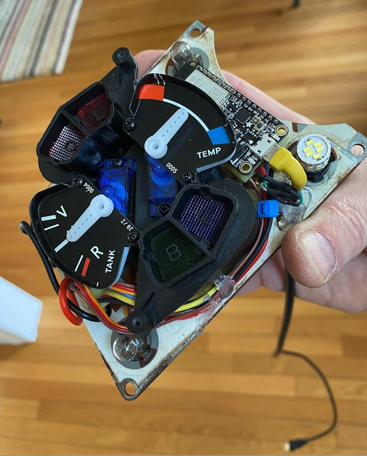
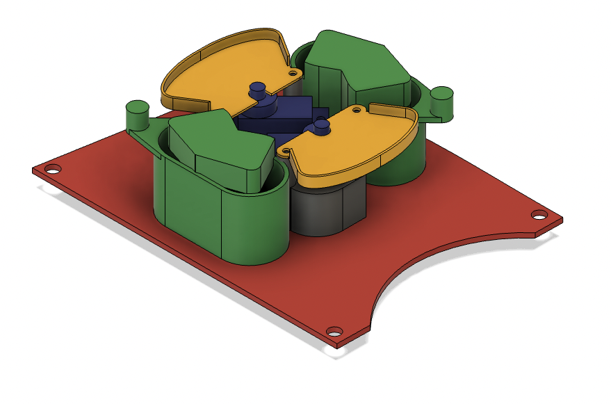

# BMW_console
1974 BMW 2002 instrument cluster mod

This is a hack that uses a 3D part to hold two servos and an ESP32 in place inside a ripped up instrument cluster for the 1974 BMW 2002. As you will see from  [BMW_console.ino](BMW_console.ino), the microcontroller reads resistance values from pins `A3` and `A4` and moves the servos connected to pins `A0` and `A1` accordingly.
   

Granularity, min and max values for senders and servos can all be set from the serial monitor.  [Servo Holder.3mf](Servo Holder.3mf) is included for printing the servo holder.  It was created using Fusion 360.

 
